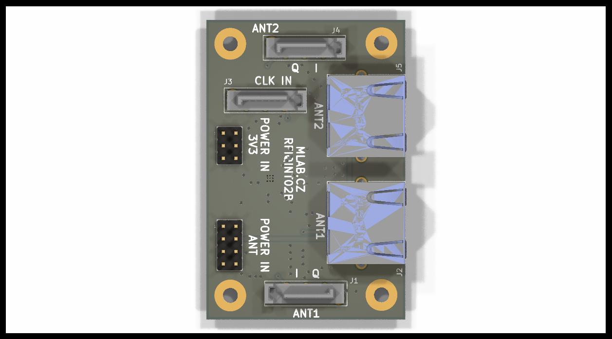

# RFIQINT02B -  RF signal I/Q interface

## Parameters

| Parameter | Value | Description |
|-----------|-------|-------------|
| Frequency range | 100 - 1000 MHz |  |
| Interface | RJ45 | CAT 7/A cable is expected |
| Operating and storage temperature | -20 - +30°C |  |
| Operational input voltage for Antenna | 9 - 12 V |  |
| Operational input voltage  | 3.3-3.6 V | 130 mA for LO buffer core |
